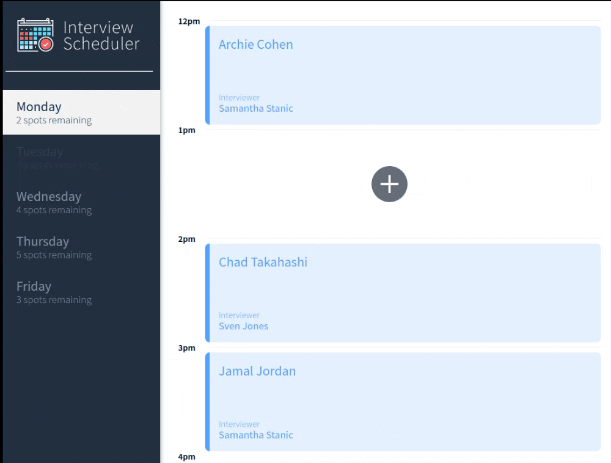
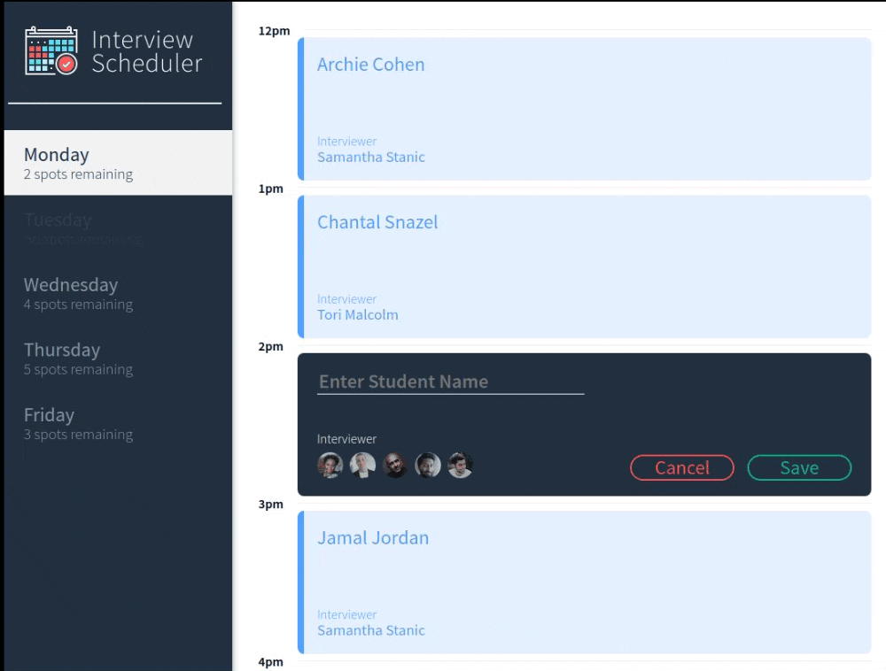
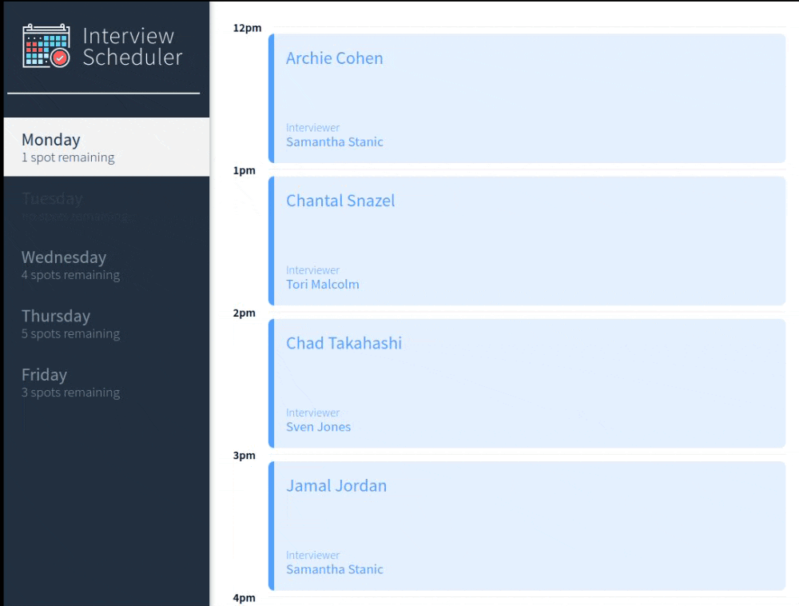
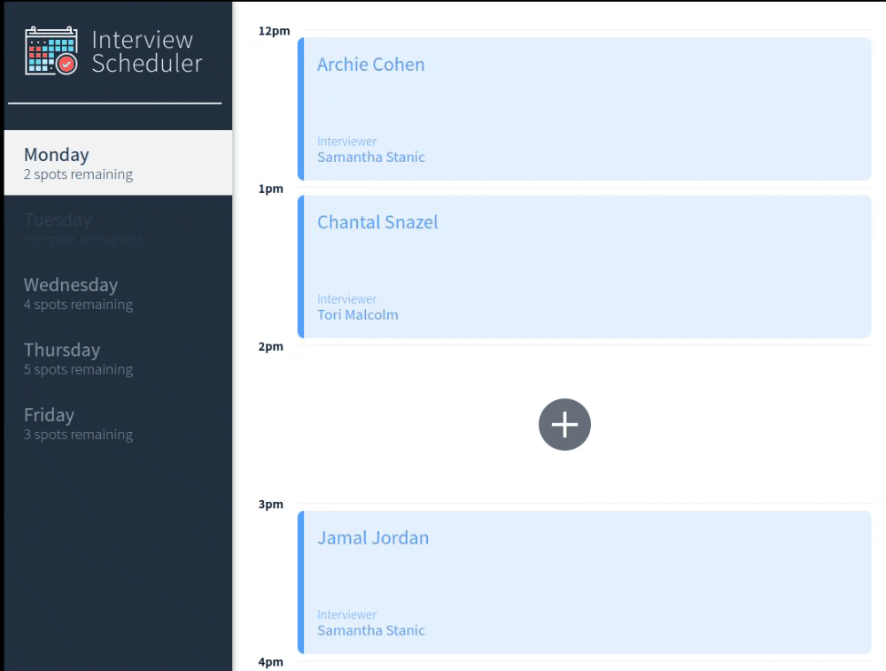

# Interview Scheduler
Welcome to Scheduler! The easy interview scheduler for 1-hour interviews from 12pm to 5pm. A project done as part of [Lighthouse Lab's](https://www.lighthouselabs.ca/) Web Development Bootcamp.

### Add an interview:

### Add error handling:

### Delete an interview:

### Delete error handling:



## Setup

Install dependencies for scheduler with `npm install`.
Set up the scheduler-api following instructions [here](https://github.com/CLSnazel/scheduler-api).

## Running Webpack Development Server

```sh
npm start
```

## Running Jest Test Framework

```sh
npm test
```

## Running Storybook Visual Testbed

```sh
npm run storybook
```

## Running Cypress End-to-End Test Framework
To view Cypress make sure there is a database named scheduler-test available in your postgres set-up. To run the scheduler-api in test mode (separate tab):
```sh
npm run test:server
```
Make a request to the database reset to populate scheduler-test.
```sh
curl http://localhost:8001/api/debug/reset
```

Running scheduler in Cypress:
```sh
npm run cypress
```